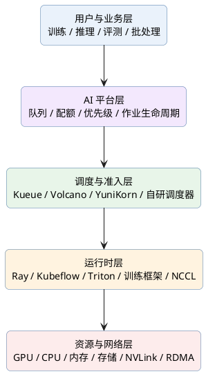
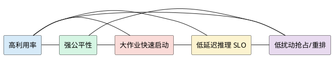
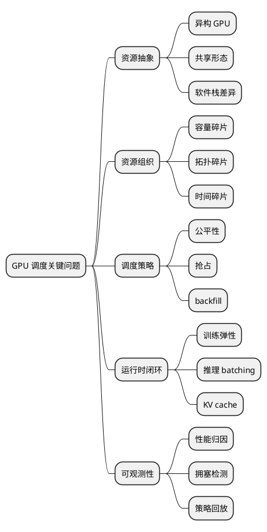
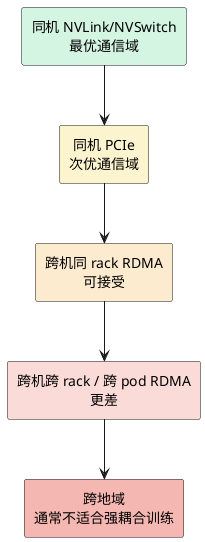
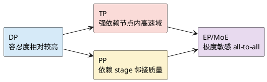
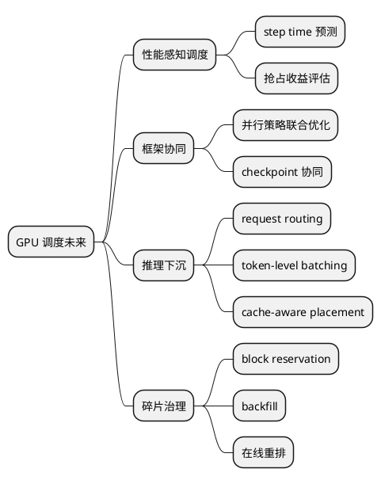

# 大规模 GPU 集群调度现状、关键技术问题与互联拓扑敏感性综述（图文增强版）

## 目录

1. [阅读导引](#一阅读导引)
2. [执行摘要](#二执行摘要)
3. [整体架构视图](#三整体架构视图)
4. [行业现状：GPU 调度正在发生什么变化](#四行业现状gpu-调度正在发生什么变化)
5. [主流系统与技术范式](#五主流系统与技术范式)
6. [当前最显著的技术问题](#六当前最显著的技术问题)
7. [为什么分布式训练对互联拓扑高度敏感](#七为什么分布式训练对互联拓扑高度敏感)
8. [NVLink、PCIe、RDMA：差异与训练含义](#八nvlinkpcierdmanbsp差异与训练含义)
9. [不同并行策略对拓扑的敏感度](#九不同并行策略对拓扑的敏感度)
10. [调度器未充分考虑拓扑时的典型后果](#十调度器未充分考虑拓扑时的典型后果)
11. [调度系统应如何改进](#十一调度系统应如何改进)
12. [未来演进方向](#十二未来演进方向)
13. [术语表](#十三术语表)
14. [参考资料](#十四参考资料)

---

## 一、阅读导引

这是一份面向长期沉淀的图文增强版综述，适合反复查阅、做内部分享底稿，或继续加工成汇报材料。相较普通版本，这一版增加了结构图、对比图和框架图，目的不是增加装饰，而是让几个最难说清的问题更容易被快速理解：

- 为什么 GPU 调度已经不是简单的资源分配问题
- 为什么大规模训练对互联拓扑如此敏感
- 为什么“调度成功”不等于“训练高效”
- 为什么未来调度系统必须从 count-based scheduling 走向 performance-aware scheduling

如果你时间有限，建议先看“执行摘要”“整体架构视图”“不同并行策略对拓扑的敏感度”三部分。

---

## 二、执行摘要

### 核心判断

当前大规模 GPU 集群调度，已经从“为训练任务分配 GPU”演变为“在异构资源、多租户治理、训练推理混部、复杂互联拓扑和成本约束下，对性能、SLO、公平性与资源利用率进行联合优化”的系统工程。

### 三个关键变化

1. **调度对象变了**：从单一训练作业，扩展到训练、推理、批处理、数据处理、缓存和伴生服务。  
2. **优化目标变了**：从吞吐和利用率，扩展到延迟、SLO、公平性、配额、成本和抢占恢复代价。  
3. **瓶颈位置变了**：很多时候问题已经不是 GPU 数量不够，而是高质量拓扑资源块、低扰动弹性能力和碎片治理能力不够。  

> 现在 GPU 集群调度的主要矛盾，已经不是“有没有足够多的 GPU”，而是“能否在正确时间，以可接受的扰动成本，把正确拓扑、正确机型、正确隔离级别的 GPU 分配给最合适的任务”。

---

## 三、整体架构视图

### 3.1 大规模 GPU 集群调度的分层结构



### 3.2 GPU 调度问题的核心张力



### 关键结论

> GPU 调度不是单一目标优化，而是在多个互相冲突的目标之间持续权衡的系统设计问题。

---

## 四、行业现状：GPU 调度正在发生什么变化

### 4.1 从“训练资源调度”走向“AI 基础设施编排”

当前调度系统需要同时面对：

- 预训练与后训练
- 在线推理与离线批推理
- 数据预处理、评测、回归测试
- checkpoint、缓存、存储通道、服务治理
- 多租户队列、公平性、优先级和配额管理

Kubernetes 提供了设备扩展资源调度的基础能力，通过设备插件暴露 GPU 资源，并支持异构节点感知[[Schedule GPUs]](https://kubernetes.io/docs/tasks/manage-gpus/scheduling-gpus/). 但实际 AI 生产环境通常会叠加 Kueue、Volcano、YuniKorn、Ray、Kubeflow 或自研平台来补足批处理准入、gang、复杂队列和拓扑优化能力。

### 4.2 训练调度与推理调度正在分化

| 维度 | 训练调度 | 推理调度 |
|---|---|---|
| 关注目标 | 吞吐、JCT、扩展效率 | 延迟、SLO、稳定性、成本 |
| 资源形态 | 大块连续 GPU、gang、拓扑友好 | 弹性扩缩、快速切换、抖动可控 |
| 最敏感问题 | 通信拓扑、同步开销、straggler | batching、路由、cache、请求波动 |
| 常见策略 | reservation、backfill、topology-aware | dynamic batching、instance_group、request scheduler |

NVIDIA Triton 采用 per-model scheduler 机制，并支持动态批处理、并发模型执行、缓存和多后端推理[[NVIDIA Triton Inference Server]](https://docs.nvidia.com/deeplearning/triton-inference-server/user-guide/docs/index.html). 这表明推理调度已经从“机器级调度”下沉到“模型级/请求级调度”。

### 4.3 碎片化正在成为超大规模集群的主要矛盾

| 类型 | 含义 |
|---|---|
| 容量碎片 | 有卡，但凑不齐大作业所需的连续块 |
| 拓扑碎片 | 有卡，但不在理想互联拓扑域里 |
| 时间碎片 | 资源释放时间零散，大作业拿不到完整窗口 |

### 关键结论

> 大规模 GPU 调度的主问题，正在从“卡不够”转向“高质量资源块不够”。

---

## 五、主流系统与技术范式

### 5.1 Kueue：队列与准入层

Kueue 将 Workload 定义为运行到完成的应用，并把它作为准入单元；Workload 可由多个 podSets 组成，资源计算与准入基于 podSets 完成[[Workload | Kueue - Kubernetes]](https://kueue.sigs.k8s.io/docs/concepts/workload/). 其能力覆盖 WorkloadPriority、Dynamic Reclaim 和 all-or-nothing 等语义[[Workload | Kueue - Kubernetes]](https://kueue.sigs.k8s.io/docs/concepts/workload/).

### 5.2 Volcano：更接近 AI/HPC 的专用调度器

Volcano 支持 gang scheduling、异构设备调度、NUMA-aware、task-topology scheduling、network topology-aware scheduling、在线离线混部和 GPU virtualization[[Introduction | Volcano]](https://volcano.sh/en/docs/). 它引入 HyperNode 作为网络性能域的树状抽象，用于表达跨机通信性能差异[[Network Topology Aware Scheduling | Volcano]](https://volcano.sh/en/docs/network_topology_aware_scheduling/).

### 5.3 YuniKorn：公平性、队列与 gang 语义

YuniKorn 强调“满足最小资源再启动”的 gang 语义，并建议在 gang 场景采用 FIFO 排序以减少资源切碎[[Gang Scheduling | Apache YuniKorn]](https://yunikorn.apache.org/docs/user_guide/gang_scheduling/).

### 5.4 Triton：推理 runtime 级调度器

Triton 不仅提供模型服务，还内建 request scheduler、dynamic batching、sequence batching 和 concurrent execution[[NVIDIA Triton Inference Server]](https://docs.nvidia.com/deeplearning/triton-inference-server/user-guide/docs/index.html). 这意味着推理调度必须与 runtime 协同，而不是只在集群层解决。

---

## 六、当前最显著的技术问题

### 6.1 八个核心问题

1. 异构资源难以统一建模  
2. GPU 碎片化严重，尤其是拓扑级碎片  
3. 拓扑感知调度缺少端到端闭环  
4. 训练弹性不足，抢占与重排成本高  
5. 推理调度面临尾延迟、KV cache 与流量波动难题  
6. 细粒度 GPU 共享提高利用率但并非通用解  
7. 数据、存储和 I/O 尚未充分纳入调度闭环  
8. 可观测性与调度归因能力不足  

### 6.2 问题分层图



### 关键结论

> 今天 GPU 调度的难点越来越不是某个单点算法，而是资源抽象、调度策略、训练/推理运行时和观测归因的联动能力。

---

## 七、为什么分布式训练对互联拓扑高度敏感

分布式训练的一个 step，并不是“各算各的”，而是多个 rank 持续交换梯度、激活、参数碎片或 token 路由信息。其耗时通常可拆为：

| 组成 | 含义 |
|---|---|
| compute time | 前向/反向计算 |
| communication time | all-reduce / all-gather / reduce-scatter / all-to-all |
| pipeline stall | 流水等待 |
| load imbalance | rank 间不均衡 |
| straggler overhead | 慢链路/慢节点拖尾 |

因此训练性能不仅取决于单卡算力，还取决于 GPU 之间如何通信。

### 7.1 训练性能瓶颈迁移示意

```plantuml
@startuml
skinparam backgroundColor transparent
skinparam shadowing false
skinparam defaultTextAlignment center

rectangle "单卡阶段\n主要瓶颈：计算/显存" as S1 #D6EAF8
rectangle "小规模分布式\n主要瓶颈：计算 + 同步" as S2 #D5F5E3
rectangle "大规模分布式\n主要瓶颈：通信拓扑 + 拖尾 + 拥塞" as S3 #FADBD8

S1 --> S2 --> S3
@enduml
```

### 关键结论

> 更多 GPU 并不自动带来更高吞吐；更多 GPU 同时也意味着更多通信，而通信质量决定了扩展效率上限。

---

## 八、NVLink、PCIe、RDMA：差异与训练含义

Volcano 在网络拓扑调度文档中指出，大模型训练中模型并行跨节点会引入频繁且大量的数据交换，不同网络类型和交换层级会显著影响延迟与吞吐[[Network Topology Aware Scheduling | Volcano]](https://volcano.sh/en/docs/network_topology_aware_scheduling/).

### 8.1 三类互联的直观比较

| 互联类型 | 典型位置 | 主要特点 | 对训练的意义 |
|---|---|---|---|
| PCIe | 节点内通用总线 | 通用、普遍，但路径和性能不够理想 | 可用，但高强度通信下容易成为瓶颈 |
| NVLink / NVSwitch | 节点内 GPU 高速域 | 高带宽、低时延、结构更适合 GPU-GPU 通信 | 适合 TP、局部 all-reduce、局部 all-to-all |
| RDMA | 节点间高性能网络 | 支持高性能跨节点通信，但受 fabric 层级与拥塞影响大 | 是大规模跨节点训练的基础设施 |

### 8.2 通信层级图



### 8.3 DGX 类架构说明了节点内外拓扑的重要性

NVIDIA DGX H100/H200 系统在单机内部部署四颗 NVSwitch 芯片，并使用多路 ConnectX-7 适配器接入计算 fabric[[Core Components — NVIDIA DGX BasePOD: The Infrastructure Foundation for Enterprise AI Reference Architecture Featuring NVIDIA DGX B200, H200 and H100 Systems]](https://docs.nvidia.com/dgx-basepod/reference-architecture-infrastructure-foundation-enterprise-ai/latest/core-components.html). DGX BasePOD 参考架构还使用 QM9700 NDR InfiniBand 交换机构建高带宽、低时延、多路径的跨节点计算网络[[Core Components — NVIDIA DGX BasePOD: The Infrastructure Foundation for Enterprise AI Reference Architecture Featuring NVIDIA DGX B200, H200 and H100 Systems]](https://docs.nvidia.com/dgx-basepod/reference-architecture-infrastructure-foundation-enterprise-ai/latest/core-components.html). 这表明大规模训练性能天生就是“节点内高速域 + 节点间高性能 fabric”共同决定的。

---

## 九、不同并行策略对拓扑的敏感度

| 并行方式 | 敏感度 | 主要原因 |
|---|---|---|
| Data Parallel | 中等 | 梯度同步通常在 step 末尾发生 |
| Tensor Parallel | 很高 | 每层前后频繁通信，位于关键路径 |
| Pipeline Parallel | 高 | 相邻 stage 传输决定流水效率 |
| Expert Parallel / MoE | 很高 | all-to-all 对尾延迟和拥塞极其敏感 |

### 9.1 并行策略与拓扑要求图



### 关键结论

> 对 TP-heavy、EP-heavy 作业而言，拓扑质量往往直接决定训练吞吐上限，而不是简单影响几个百分点。

---

## 十、调度器未充分考虑拓扑时的典型后果

### 10.1 常见错误模式

- 只按 GPU 数量调度，不按通信域调度
- 只感知节点，不感知节点内 GPU 拓扑
- 不区分不同作业的通信画像
- 只看静态拓扑，不看实时网络状态
- 调度器、训练框架和通信库脱节

### 10.2 结果链路图

```plantuml
@startuml
skinparam backgroundColor transparent
skinparam shadowing false
skinparam defaultTextAlignment center

rectangle "忽略拓扑细节" as A #FADBD8
rectangle "placement 次优" as B #FDEBD0
rectangle "通信开销增大" as C #FCF3CF
rectangle "step time 抖动 / straggler 增加" as D #E8DAEF
rectangle "扩展效率下降" as E #D6EAF8
rectangle "整体训练吞吐下降" as F #F5CBA7

A --> B --> C --> D --> E --> F
@enduml
```

### 关键结论

> “调度成功”并不等于“训练高效”；可分配资源与高质量拓扑资源是两种完全不同的概念。

---

## 十一、调度系统应如何改进

### 11.1 从 count-based scheduling 升级到 topology-aware scheduling

调度器至少需要理解：

| 层级 | 需要建模的内容 |
|---|---|
| GPU 级 | 型号、显存、健康、MIG |
| 节点内级 | NVLink / NVSwitch 图、PCIe tree、NUMA、GPU-NIC 亲和 |
| 节点间级 | rack / TOR / pod / fabric |
| 网络级 | RDMA 带宽、oversubscription、拥塞域 |
| 作业级 | 并行策略、通信模式、可抢占性 |

### 11.2 从 topology-aware 再走向 performance-aware scheduling

未来更有价值的问题是：

- 这个作业放在这组资源上，step time 大概是多少？
- 是否会形成慢 rank？
- 是否值得等待更优资源块？
- 哪次抢占总体收益为正？

### 11.3 调度改进路线图

```plantuml
@startuml
skinparam backgroundColor transparent
skinparam shadowing false
skinparam defaultTextAlignment center

rectangle "阶段 1\n按 GPU 数量调度" as S1 #FADBD8
rectangle "阶段 2\n加入 gang / queue / quota" as S2 #FCF3CF
rectangle "阶段 3\n加入 topology-aware" as S3 #D5F5E3
rectangle "阶段 4\n加入 telemetry-informed" as S4 #D6EAF8
rectangle "阶段 5\nperformance-aware + runtime 协同" as S5 #E8DAEF

S1 --> S2 --> S3 --> S4 --> S5
@enduml
```

DGX BasePOD 的架构设计表明，多路 HCA、多条并行路径和高性能 fabric 是大规模训练的基础条件，因此 GPU-NIC 亲和、HCA 映射、多 rail 利用和 fabric 遥测必须进入调度闭环[[Core Components — NVIDIA DGX BasePOD: The Infrastructure Foundation for Enterprise AI Reference Architecture Featuring NVIDIA DGX B200, H200 and H100 Systems]](https://docs.nvidia.com/dgx-basepod/reference-architecture-infrastructure-foundation-enterprise-ai/latest/core-components.html).

---

## 十二、未来演进方向

未来更值得关注的方向包括：

- 从资源感知走向性能感知调度
- 调度器与训练框架更深度协同
- 推理调度越来越请求级化
- 碎片治理成为平台收益主战场

### 12.1 未来方向图



---

## 十三、术语表

### GPU 集群调度
指在共享 GPU 资源池中，为训练、推理等作业进行资源分配、队列治理、优先级控制、抢占和放置优化的系统能力。

### Gang Scheduling
一个分布式作业所需的一组资源必须同时满足，否则整体等待，不产生半启动状态的调度语义。

### Topology-aware Scheduling
调度器在分配资源时显式考虑节点内外互联拓扑，例如 NVLink、PCIe、NUMA、rack、TOR、InfiniBand fabric 等结构。

### NVLink / NVSwitch
NVIDIA 的节点内高带宽低时延 GPU 互联技术。NVSwitch 通常用于在单机多 GPU 间构建更高质量的交换域。

### PCIe
通用设备互联总线，GPU、NIC、SSD 等都可挂载在其上。对高强度 GPU-GPU 通信而言，性能和路径规律性通常弱于 NVLink。

### RDMA
远程直接内存访问，常基于 InfiniBand 或 RoCE，用于支持高性能跨节点通信，是大规模分布式训练的基础设施之一。

### DP / TP / PP / EP
- **DP**：Data Parallel，数据并行  
- **TP**：Tensor Parallel，张量并行  
- **PP**：Pipeline Parallel，流水并行  
- **EP**：Expert Parallel，专家并行  

### MIG
Multi-Instance GPU。将单个 GPU 切分为多个相互隔离实例的机制，适合部分推理与多租户共享场景。

### KV Cache
大语言模型推理中缓存历史上下文键值对的机制，显著影响显存占用、推理延迟与调度策略。

---

## 十四、参考资料

1. [Workload | Kueue - Kubernetes](https://kueue.sigs.k8s.io/docs/concepts/workload/)
2. [Introduction | Volcano](https://volcano.sh/en/docs/)
3. [Network Topology Aware Scheduling | Volcano](https://volcano.sh/en/docs/network_topology_aware_scheduling/)
4. [Gang Scheduling | Apache YuniKorn](https://yunikorn.apache.org/docs/user_guide/gang_scheduling/)
5. [Schedule GPUs](https://kubernetes.io/docs/tasks/manage-gpus/scheduling-gpus/)
6. [NVIDIA Triton Inference Server](https://docs.nvidia.com/deeplearning/triton-inference-server/user-guide/docs/index.html)
7. [Introduction — NVIDIA Multi-Instance GPU User Guide](https://docs.nvidia.com/datacenter/tesla/mig-user-guide/introduction.html)
8. [Core Components — NVIDIA DGX BasePOD: The Infrastructure Foundation for Enterprise AI Reference Architecture Featuring NVIDIA DGX B200, H200 and H100 Systems](https://docs.nvidia.com/dgx-basepod/reference-architecture-infrastructure-foundation-enterprise-ai/latest/core-components.html)
